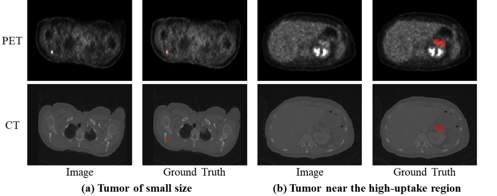
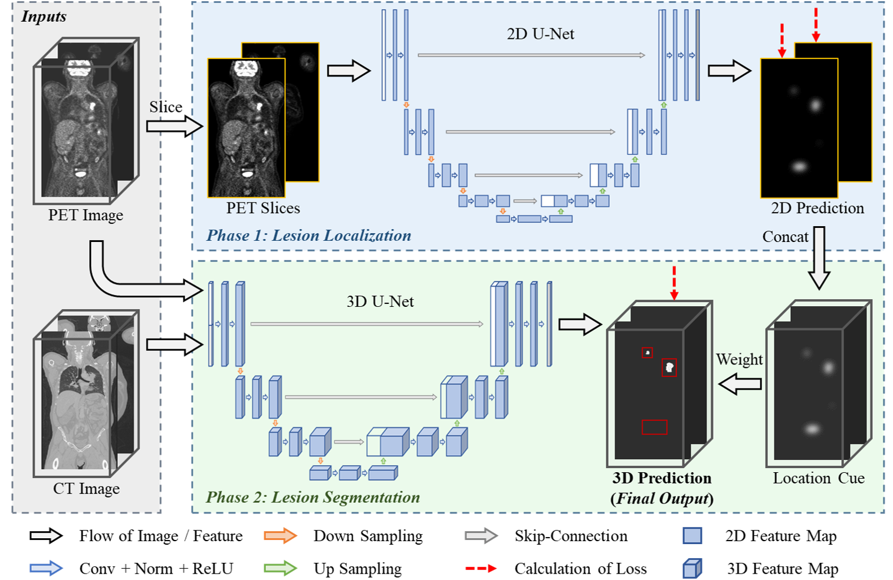

# A Localization-to-Segmentation Framework for automatic tumor segmentation in PET/CT images
Address: [http://arxiv.org/abs/2309.05446](L2SNet) 
## 1. Introduction

Flouro Deoxy Glucose (FDG) positron emission tomography (PET) combined with computed tomography (CT) is considered the preferred imaging modality for diagnosing, staging, and monitoring the treatment responses in various cancers, such as lung cancer and melanoma. This choice arises from PET/CT’s ability to leverage the high sensitivity of PET in localizing abnormal tissue function and the specificity of CT in mapping lesions. Tumor segmentation is an essential step in PET/CT quantitative analysis. However, manual annotation is time-consuming and complicated in the clinic, which limits the effect of PET/CT examination. Fortunately, the development of deep learning gives rise to many automatic tumor segmentation algorithms, which have achieved promising performance in whole-body PET/CT image segmentation.

Despite the availability of advanced methods, precise tumor segmentation in PET/CT images remains a challenging task, for two significant reasons: (i) The small size of tumors poses a difficulty for localizing these abnormal regions, as shown in Fig. 1(a). (ii) As shown in Fig. 1(b), some tumors are adjacent to normal high-uptake regions, causing existing segmentation methods to over-segment the abnormal regions and incorporate areas such as normal high-uptake organs, inflammation, and other infections into the identified tumor regions. Hence, a segmentation method that can accurately localize the tumors and outline their boundaries is urgent for PET/CT image analysis.

<p align="center">
     <br />
    <em> 
    Fig. 1. Visual illustration of the challenges in automatic tumor segmentation in whole-body PET/CT images. The red region represents the tumor area.
    </em>
</p>

To address these issues, we propose a Localization-to-Segmentation framework (L2SNet). Our motivation stems from the fact that, during tumor annotation, clinicians first capture possible lesions in 2D slices and then depict them in the 3D space. We, therefore, argue that localization first and then segmentation is a reasonable solution for distinguishing tumors and normal regions. To achieve this goal, we first predict segmentation results with 2D slices and then use them to guide the 3D segmentation model to focus on the possible tumors. The performance of L2SNet is evaluated in the Automated Lesion Segmentation in Whole-body PET/CT (AutoPET-II) Challenge.

## 2. Methods

<p align="center">
     <br />
    <em> 
    Fig. 2. Overview of our proposed L2SNet. The red boxes in the 3D prediction reflect the differences between the 3D prediction map and the 2D prediction map.
    </em>
</p>

As shown in Fig. 2, the proposed L2SNet consists of two phases, namely the lesion localization phase and the lesion segmentation phase. The former takes the 2D PET slices as input and generates the location cue of lesions. Afterward, the lesion segmentation phase uses the location cue as a spatial weight to guide the 3D segmentation network for shaping the lesions.

## 3. Conclusion

We introduce a localization-to-segmentation framework for the [MICCAI 2023 AutoPET-II challenge](https://autopet-ii.grand-challenge.org/). The current ranking of our results can be found on the [leaderboard](https://autopet-ii.grand-challenge.org/evaluation/challenge/leaderboard/).

## 4. Citation

If you wish to cite this work, feel free to use this BibTeX reference:

```bibtex
@article{cai2023l2snet,
    title={A Localization-to-Segmentation framework for automatic tumor segmentation in whole-body PET/CT images},
    author={Linghan Cai, Jianhao Huange, Zihang Zhu, Jinpeng Lu, Yongbing Zhang},
    year={2023},
    month={September},
    journal={arXiv preprint arXiv:2309.05446},
}
```

## 5. Contributing

Thanks to the following work for improving our project：
- AutoPET-II: [https://autopet-ii.grand-challenge.org/](AutoPET-II)
- nnUNet: [https://github.com/MIC-DKFZ/nnUNet/tree/master/nnunetv2](nnUNet)
  
## 6. License

The source code is free for research and education use only. Any comercial use should get formal permission first.
